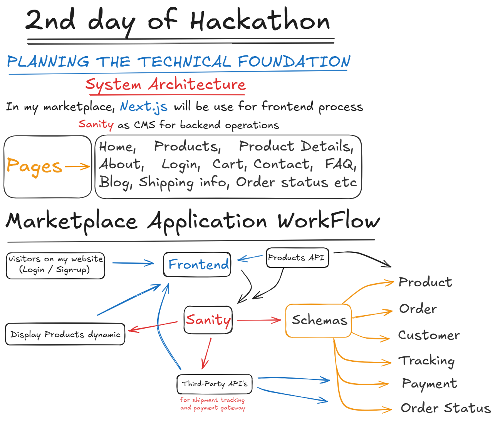

# Marketplace Technical Foundation - E-commerce website (Hekto)

## 1. System Architecture Overview

### Diagram
Below is the system architecture diagram showcasing the interaction between the frontend, Sanity CMS, and third-party APIs:

- **Frontend**: Built using Next.js, the frontend provides dynamic and responsive user interfaces for browsing products, managing the cart, and placing orders.
- **Sanity CMS**: Acts as the backend for managing product, customer, and order data. It also provides APIs to retrieve and update this information.
- **Third-Party APIs**: Integrated for payment processing and shipment tracking.




### Component Roles
- **Frontend**:
  - Handles user interactions and dynamic content rendering.
  - Communicates with Sanity CMS and third-party APIs via RESTful calls.
- **Sanity CMS**:
  - Stores product, order, and customer schemas.
  - Manages content updates and serves API requests for the frontend.
- **Third-Party APIs**:
  - Payment Gateway: Processes online payments.
  - Shipment Tracking: Provides real-time order tracking.

---

## 2. Key Workflows

### User Workflows

#### **1. Product Browsing and Dynamic Display**
1. Visitor accesses the website.
2. Frontend fetches product data from Sanity CMS using the `/products` endpoint.
3. Products are dynamically displayed on the frontend.

#### **2. Adding Products to Cart**
1. User selects a product and clicks "Add to Cart."
2. Frontend updates the cart state and optionally stores it in local storage or backend.

#### **3. Placing an Order**
1. User reviews the cart and proceeds to checkout.
2. Frontend sends a POST request to Sanity CMS to create an order.
3. Payment is processed using a third-party API.
4. Shipment tracking details are retrieved and displayed to the user.

---

## 3. Category-Specific Instructions

### General eCommerce
- **Workflow**: Product browsing, cart management, order placement.
- **Example Endpoint**:
  - `/products`: Fetches all product listings.
  - `/order-status`: Provides real-time order updates.

### Q-Commerce (Quick Commerce)
- **Key Features**:
  - Real-time inventory updates.
  - Delivery SLA tracking.
  - Express delivery workflows.
- **Example Endpoint**:
  - `/express-delivery-status`: Fetches real-time delivery tracking.

### Rental eCommerce
- **Key Features**:
  - Manage rental duration, deposit amount, and condition reports.
- **Example Schema Fields**:
  - `rentalDuration`, `depositAmount`, `conditionStatus`.

---

## 4. API Endpoints

| Endpoint                | Method | Purpose                                | Response Example                                    |
|-------------------------|--------|----------------------------------------|----------------------------------------------------|
| `/products`             | GET    | Fetches all product details            | `{ "id": 1, "name": "Product A", "price": 100 }` |
| `/order`                | POST   | Creates a new order                    | `{ "orderId": 123, "status": "created" }`       |
| `/payment`              | POST   | Processes payment                      | `{ "paymentId": 456, "status": "success" }`     |
| `/shipment-tracking`    | GET    | Retrieves shipment tracking information | `{ "trackingId": "789XYZ", "status": "in-transit" }` |

---

## 5. Sanity Schema Examples

### Product Schema
```javascript
export default {
  name: 'product',
  type: 'document',
  fields: [
    { name: 'name', type: 'string', title: 'Product Name' },
    { name: 'price', type: 'number', title: 'Price' },
    { name: 'stock', type: 'number', title: 'Stock Level' },
    { name: 'description', type: 'text', title: 'Description' },
    { name: 'image', type: 'image', title: 'Product Image' }
  ]
};
```

### Order Schema
```javascript
export default {
  name: 'order',
  type: 'document',
  fields: [
    { name: 'orderId', type: 'string', title: 'Order ID' },
    { name: 'customerId', type: 'string', title: 'Customer ID' },
    { name: 'products', type: 'array', of: [{ type: 'reference', to: [{ type: 'product' }] }], title: 'Products' },
    { name: 'totalAmount', type: 'number', title: 'Total Amount' },
    { name: 'status', type: 'string', title: 'Order Status' }
  ]
};
```

---

## 6. Technical Roadmap

### Milestones
1. **Frontend Development**:
   - Set up Next.js project.
   - Implement pages: Home, Products, Product Details, About, Cart, Contact, FAQ, Blog, Shipping Info, and Order Status.

2. **Sanity CMS Integration**:
   - Define schemas for Product, Order, Customer, and Tracking.
   - Integrate APIs for fetching and updating data.

3. **Third-Party API Integration**:
   - Implement payment gateway.
   - Add shipment tracking functionality.

4. Testing and Deployment:
   - Conduct unit and integration testing.
   - Deploy the application to Vercel.


