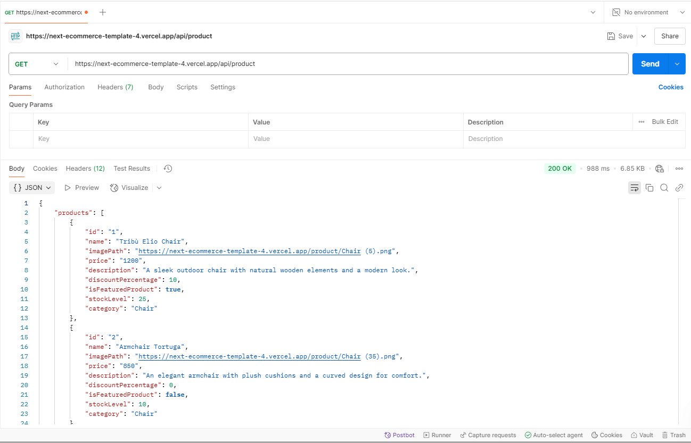
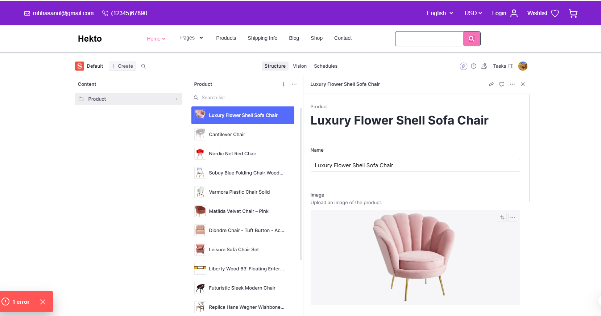
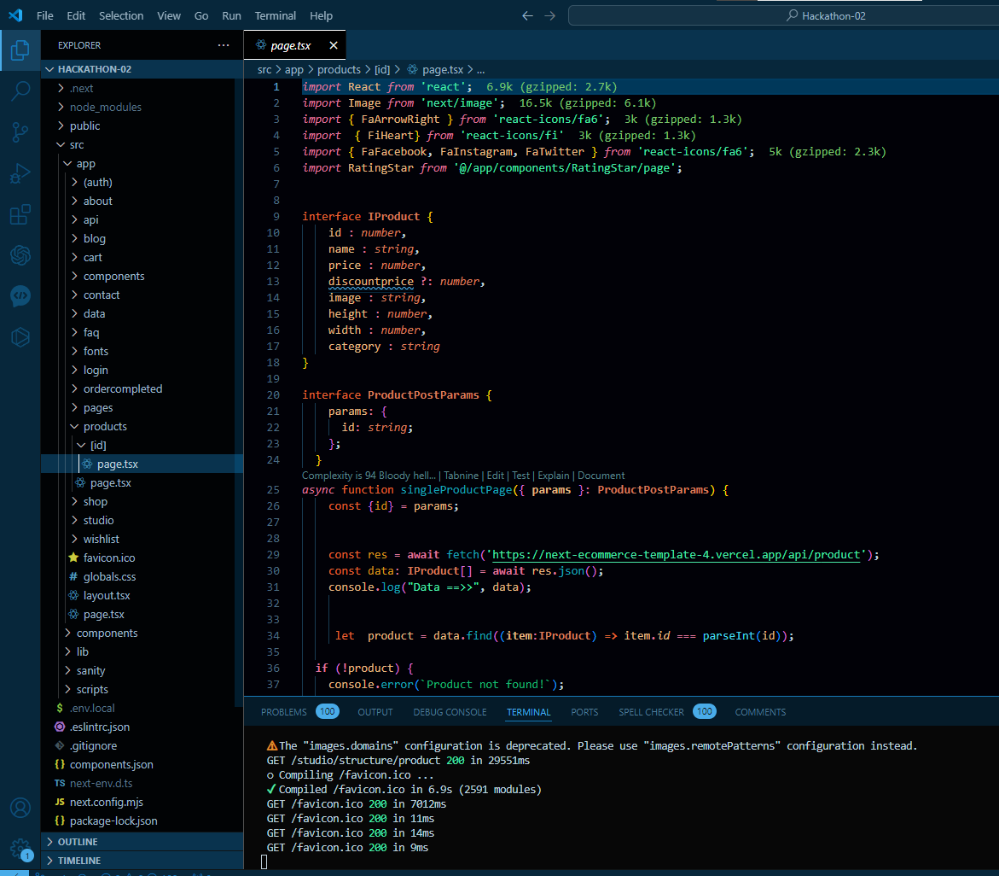

# Day 3 - API Integration and Data Migration  
 Hekto (E-commerce Marketplace)  

## Objective  
The goal for Day 3 was to integrate APIs, migrate data into **Sanity CMS**, and build a functional backend for the marketplace. This task mirrors real-world practices of working with headless APIs and data migration from diverse eCommerce platforms.  

---

## Key Learning Outcomes  
1. Successfully integrated APIs into the **Next.js** project.  
2. Migrated data into **Sanity CMS**, ensuring compatibility with the schema.  
3. Utilized data from external sources to populate the backend.  
4. Validated and adjusted schemas to align with API data structure.  
5. Rendered data in the frontend to display product listings and categories.  

---

## Steps Taken  

### 1. **API Integration**  
- **API Documentation Review**:  
  Reviewed the provided API documentation to identify key endpoints, including:  
  - **Product Listings**: `/products`  
  - **Categories**: `/categories`  

- **Utility Functions**:  
  Created reusable utility functions to fetch data from the API and handle error cases.  

- **Frontend Integration**:  
  - Rendered data dynamically in the **Projects** section of the Hekto marketplace.  
  - Added error handling to ensure a smooth user experience, including skeleton loaders and fallback data.  

---

### 2. **Schema Validation and Adjustments**  
- **Sanity Schema Updates**:  
  Compared API field names with the existing schema and adjusted field mappings.  
  Example:  
  - **API Field**: `product_title`  
  - **Schema Field**: `name`  

- Added relationships and refined field types for better data alignment, ensuring compatibility with imported data.  

---

### 3. **Data Migration**  
Migrated data into **Sanity CMS** using a combination of manual imports and script-based approaches:  
- **Manual Import**:  
  Exported sample JSON data and imported it using Sanity's built-in tools for smaller datasets.  

- **Script-Based Migration**:  
  - Wrote scripts to fetch, transform, and import data directly from the API into Sanity.  
  - Validated data to ensure all fields aligned with the updated schema.  

- **Populated Fields**:  
  Successfully imported and validated data for:  
  - Products  
 

---

### 4. **Testing and Debugging**  
- **API Testing**:  
  Used **Postman** and browser developer tools to test endpoints and ensure data consistency.  

- **Frontend Testing**:  
  Verified that the imported data displayed correctly in the frontend, including:  
  - Product listings in the **Projects** section.  
  - Categories in the sidebar.  

- **Error Handling**:  
  Implemented centralized error logging and displayed user-friendly error messages.  

---

## Best Practices Followed  
1. **Backup**: Ensured a backup of the Sanity project before importing large datasets.  
2. **Validation**: Included validation checks in migration scripts to handle errors gracefully.  
3. **Scalability**: Followed modular coding practices for API utility functions.  

---

## Expected Outputs  
1. **Sanity CMS** populated with data from:  
   - Provided API  
   - External sources (if applicable)  
   - Manual uploads  

2. **Frontend Display**:  
   - Product listings displayed dynamically in the **Projects** section.  
   - Categories rendered appropriately.  

---

## Screenshots  
1. **API Call Testing**:  
     

2. **Sanity CMS Populated Fields**:  
     

3. **Frontend Display**:  
   

---

## Code Snippets  

### API Utility Function  
```javascript  
import axios from 'axios';  

export const fetchProducts = async () => {  
  try {  
    const response = await axios.get('/api/products');  
    return response.data;  
  } catch (error) {  
    console.error('Error fetching products:', error);  
    return [];  
  }  
};  
```  

### Data Migration Script  
```javascript  
import sanityClient from '@sanity/client';  
import data from './data.json';  

const client = sanityClient({  
  projectId: 'your_project_id',  
  dataset: 'production',  
  useCdn: false,  
});  

const migrateData = async () => {  
  try {  
    const response = await client.createOrReplace(data);  
    console.log('Data migrated successfully:', response);  
  } catch (error) {  
    console.error('Migration failed:', error);  
  }  
};  

migrateData();  
```  

---

## Reflections  
Day 3 was both challenging and rewarding. The process of integrating APIs and migrating data into Sanity CMS provided invaluable experience. Despite the hurdles, I pushed through and successfully laid the technical foundation for the **Hekto** marketplace.  


