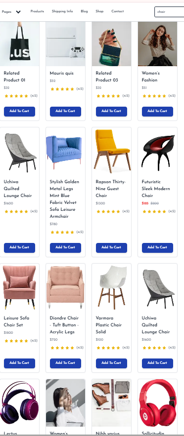

# **Day 4: Building Dynamic Frontend Components for My Marketplace**

### **Objective:**  
To design and develop essential dynamic frontend components that fetch and display data from Sanity CMS or APIs, focusing on modular, reusable, and scalable design.

---

### **Key Learning Outcomes:**
1. Develop dynamic frontend components to display data from Sanity CMS or APIs.
2. Implement reusable and modular component structures.
3. Understand state management techniques for efficient data handling.
4. Apply responsive design principles to ensure cross-device compatibility.
5. Gain experience replicating professional workflows for real-world projects.

---

### **Components Built:**

#### **1. Product Listing Component**
- **Functionality:** Displays product data dynamically in a grid layout.
- **Fields Included:**
  - Product Name
  - Price
  - Image
  - Stock Level
  - Category
  - Description

- **Implementation Details:**
  - Fetch data from APIs or Sanity CMS.
  - Render products in a responsive card layout.
  - Ensure grid adjusts seamlessly across different screen sizes.

#### **2. Product Detail Component**
- **Functionality:** Provides a detailed view of individual products.
- **Fields Included:**
  - Product Description
  - Price
  - Available Stock
- **Implementation Details:**
  - Implement dynamic routing in Next.js to create unique pages for each product.
  - Ensure navigation between product listings and detail pages is smooth.

#### **3. Category Component**
- **Functionality:** Displays product categories dynamically fetched from the data source.
- **Implementation Details:**
  - Fetch category data and render it in a list or grid format.
  - Enable users to filter products based on selected categories.

#### **4. Search Bar**
- **Functionality:** Allows users to search for products by name or tags.
- **Implementation Details:**
  - Implement a controlled input field for search queries.
  - Filter product data dynamically based on user input.

#### **5. Cart Component**
- **Functionality:** Displays added items, their quantity, and the total price.
- **Implementation Details:**
  - Use state management (e.g., React Context or useState) to track cart items.
  - Include functionality to add, remove, or update item quantities.

#### **6. Footer and Header Components**
- **Functionality:** Provide consistent navigation and branding.
- **Implementation Details:**
  - Include links to key pages such as Home, About, Contact, and Categories.
  - Ensure responsive design and accessibility for all navigation elements.

## **Functional Deliverables:**
# Project Documentation

## Screenshots:

### 1. Product Listing Page:

### 2. Individual Product Detail Pages:
  

### 3. Category Filters, Search Bar:

---

## Code Deliverables:

### 1. Code Snippets:

#### Key code snippets for essential components:

##### ProductCard

##### ProductList

##### SearchBar

##### Groq Query
 

 ##### Groq Query
 
---

### **Workflow Summary:**
1. **Planning:** Identified essential components and outlined their structure.
2. **Development:** Built reusable and modular components using React and Next.js.
3. **Testing:** Ensured components fetch and display data correctly, maintaining responsiveness across devices.
4. **Deployment:** Verified functionality in a staging environment.

---

### **Reflections:**
Day 4 focused on bridging design and functionality by developing dynamic, user-centric components. These components not only display data but also enhance user interaction and provide a scalable foundation for future development.

