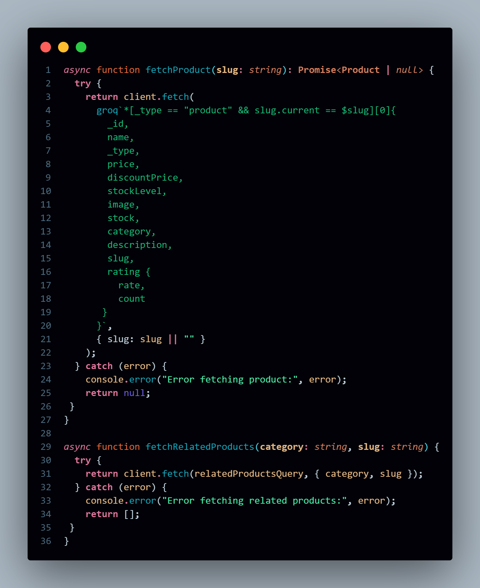
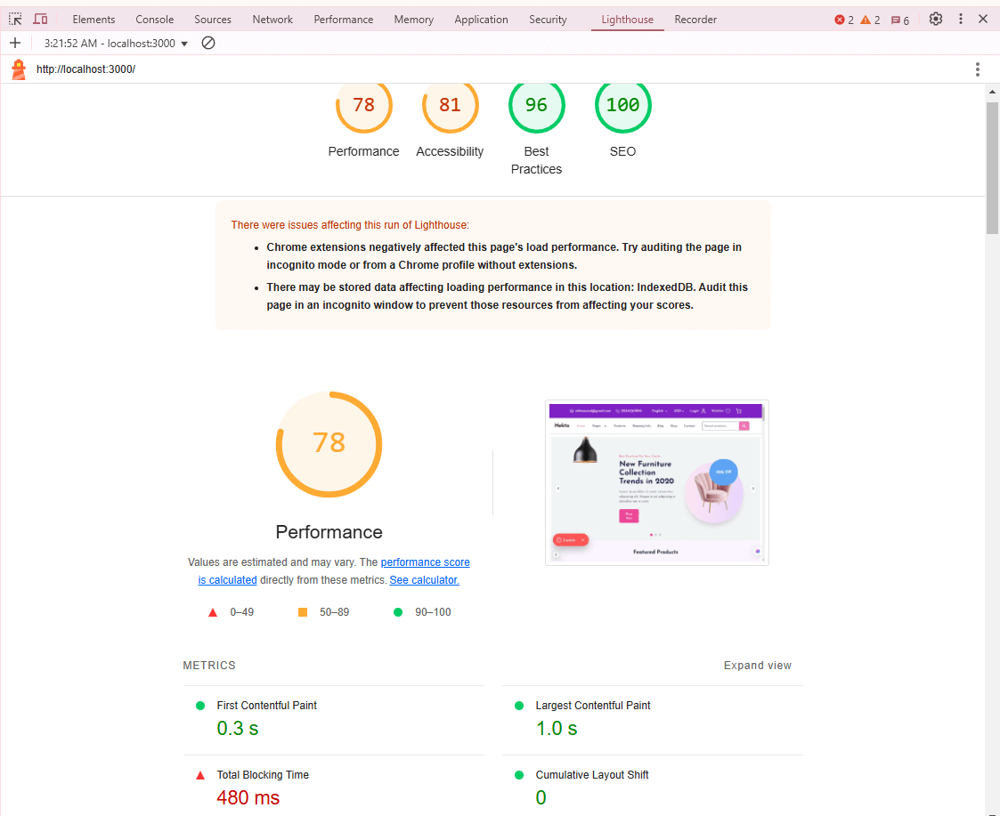
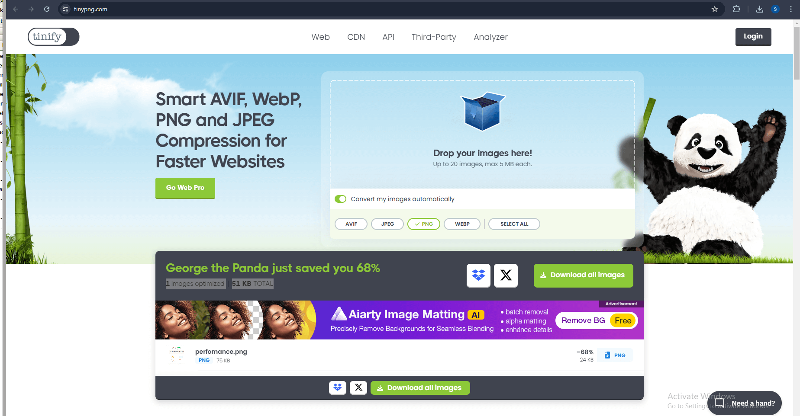
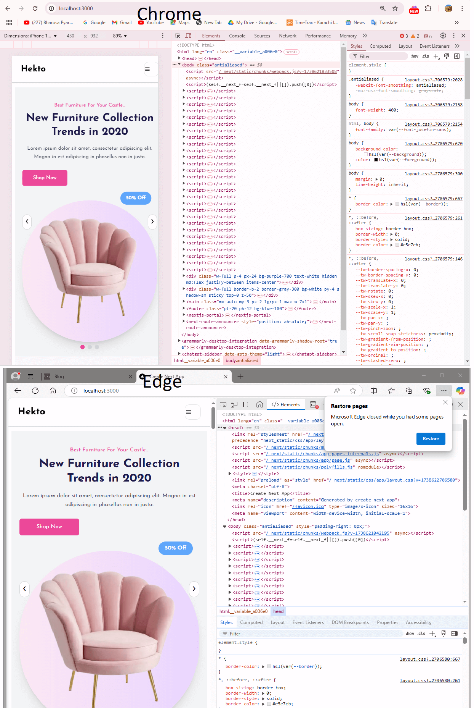
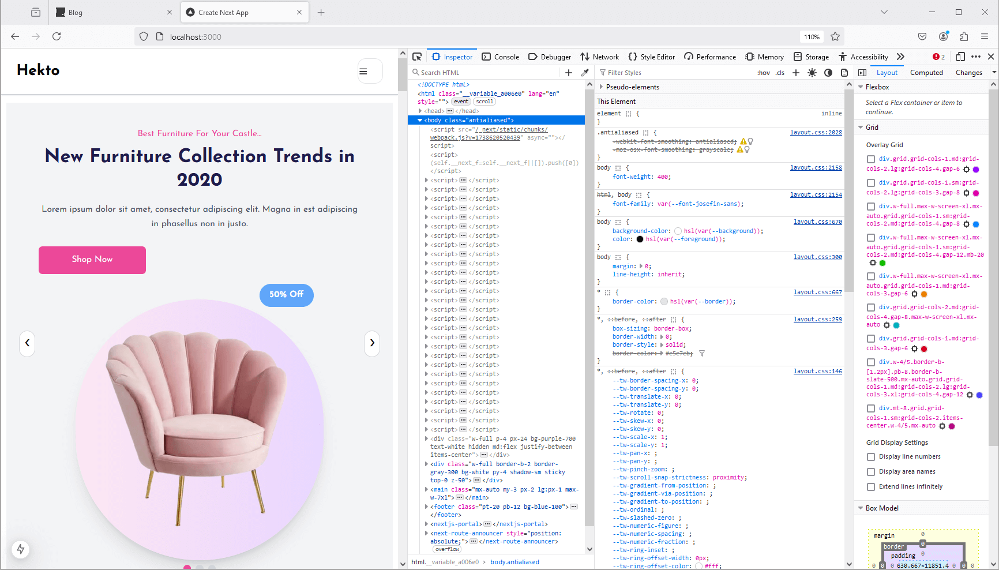
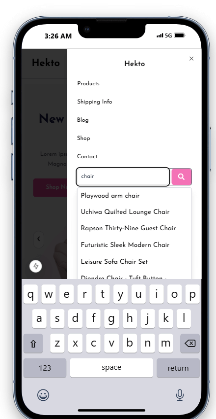
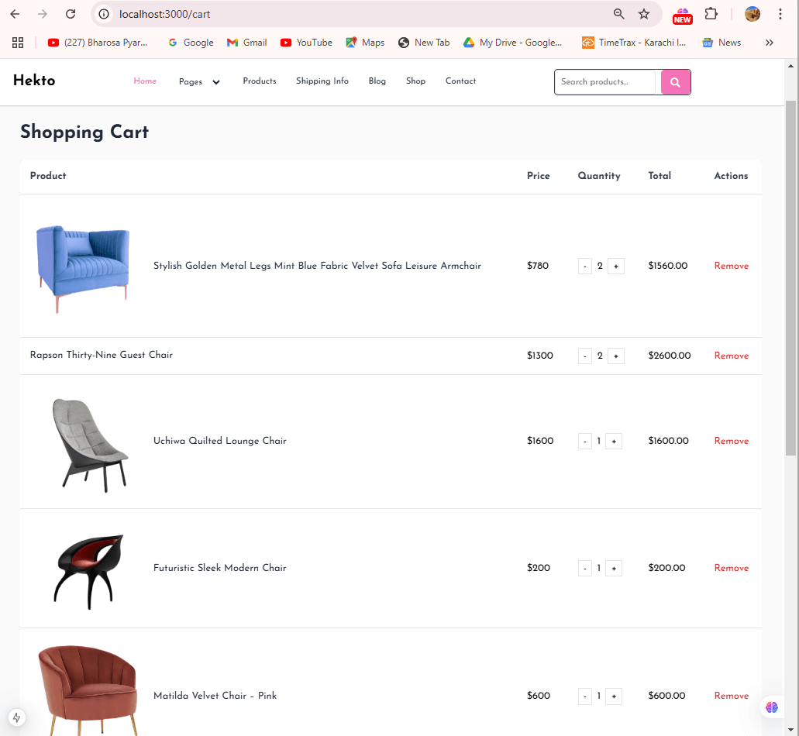
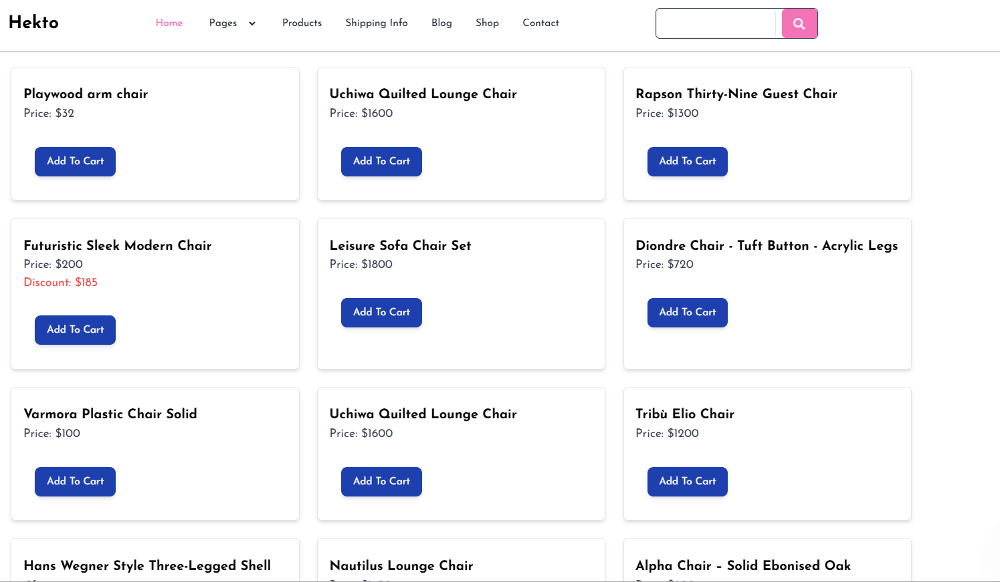
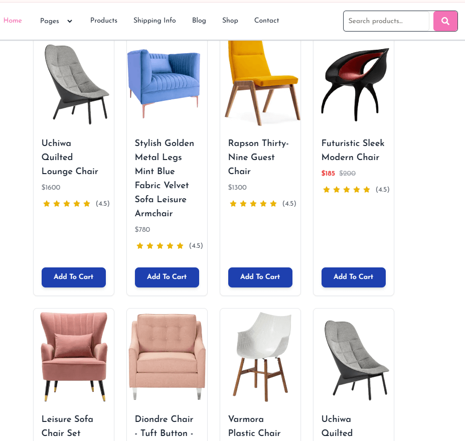

# Day 5 - Testing, Error Handling, and Backend Integration Refinement

### **Objective:**  
On Day 5, the focus is to prepare my marketplace for live deployment by performing thorough testing of all components, optimizing performance, and ensuring its readiness to handle customer traffic efficiently. Key priorities include validating backend configurations, enhancing error-handling mechanisms, and refining the overall user experience.

## 🛠️ Functional Testing
I have implemented comprehensive functional testing to validate all marketplace features. The following aspects were tested:
- ✅ **Product listing:** Ensured correct display of products.
- ✅ **Filters and search:** Verified accurate results based on user inputs.
- ✅ **Cart operations:** Tested adding, updating, and removing items.
- ✅ **Dynamic routing:** Checked proper navigation to product detail pages.


## ⚠️ Error Handling
Implemented robust error handling with clear fallback messages. Key implementations:
- ✅ **Handled network failures** gracefully.
- ✅ **Displayed user-friendly messages** for invalid or missing data.
- ✅ **Used try-catch blocks** to manage API failures.
- ✅ **Fallback UI elements:** Displayed alternative content when data is unavailable.

```javascript
  try {
    return client.fetch(relatedProductsQuery, { category, slug });
  } catch (error) {
    console.error("Error fetching related products:", error);
    return [];
  }
```

  ### Try Catch Blocks
 

## 🚀 Performance Optimization
I optimized the marketplace for speed and responsiveness using:
- ✅ **Lighthouse & GTmetrix** to identify bottlenecks.
- ✅ **Image compression** using TinyPNG.
- ✅ **Lazy loading for large assets**.
- ✅ **Browser caching & minimized CSS/JS** for faster load times.

  ### Lighthouse Performance 
 

   ### Tinypng implementation
 

## 🌐 Cross-Browser & Device Testing
I ensured compatibility across multiple devices and browsers:
- ✅ **Tested on Chrome, Firefox, and Edge.**
- ✅ **Responsive design validated using BrowserStack.**
- ✅ **Manual testing on a physical mobile device.**

   ### Tested on Different Browsers
 
 

   ### Mobile Simulator
 

## 🔒 Security Testing
I conducted security checks to ensure safe user interactions:
- ✅ **Sanitized input fields** to prevent SQL Injection & XSS attacks.
- ✅ **Used HTTPS for secure API calls.**
- ✅ **Stored API keys in environment variables.**
- ✅ **Validated user inputs using regex patterns.**


## 👥 User Acceptance Testing (UAT)
Simulated real-world user scenarios to validate:
- ✅ **Browsing, searching, and checkout flows.**
- ✅ **User-friendly navigation and interactions.**
- ✅ **Gathered feedback and applied necessary fixes.**

   ### Testing as UAT
 


## 📄 Testing Report
   ### Encounter an Error
- ✅ 🚨 Problem: The Images were not rendering properly
 
  ### Error Resolved
- ✅ Solution: The issue was resolved, the images load successfully across all devices.
 
- ✅ **Prepared CSV-based test report with all test cases and results.**
  [Download Test Report](report.csv)  

### Test Report Overview
Below is a summary of the test cases included in the report:

| S/No. | Test Case ID | Test Case Description           | Test Steps                              | Expected Result                  | Actual Result                    | Status  | Severity Level | Assigned To | Remarks             |
|-------|--------------|---------------------------------|-----------------------------------------|----------------------------------|----------------------------------|---------|-----------------|-------------|---------------------|
| 1     | TC001        | Validate product listing page   | Open product page > Verify products     | Products displayed correctly     | Products displayed correctly     | Passed  | Medium          | -           | No issues found     |
| 2     | TC002        | Test API error handling         | Disconnect API > Refresh page           | Show fallback UI with error message | Error message shown           | Passed  | Medium          | -           | Handled gracefully  |
| 3     | TC003        | Check cart functionality        | Add product to cart > Verify cart contents | Cart updates with added product | Cart updates as expected        | Passed  | High            | -           | Works as expected   |
| 4     | TC004        | Ensure responsiveness on mobile | Resize browser window > Check layout    | Layout adjusts properly to screen size | Responsive layout working as intended | Passed  | Medium          | -           | Test successful     |

---


## ✅ Final Checklist
✔️ Fully tested and optimized marketplace.
✔️ Implemented robust error handling and fallback UI.
✔️ Improved page load speed and responsiveness.
✔️ Validated security measures and cross-browser compatibility.
✔️ Documented test cases and submitted testing reports.
✔️ Uploaded all updates to GitHub.


---

